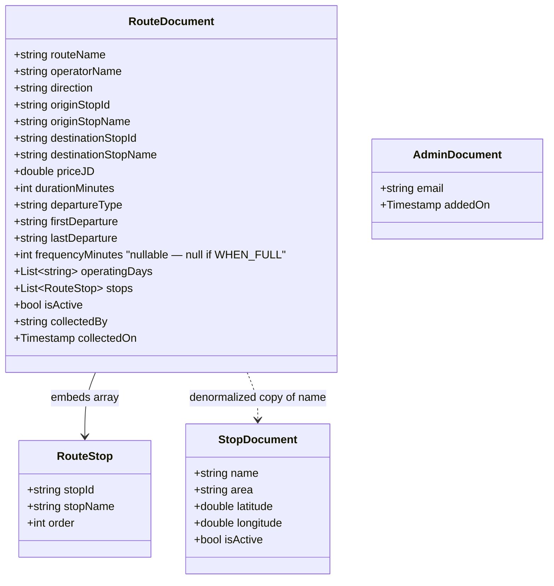

# Coasterna — Firestore Data Model

## Why NoSQL instead of an ER Diagram

This project stores data in Cloud Firestore, a NoSQL document database.
There are no foreign keys and no joins. Data is denormalized instead —
duplicated in the places it is read, so a search costs exactly one
query. This replaces the classic ER Diagram in Chapter 4.2.4.

## Collections

## Denormalization rationale

`RouteDocument` stores `originStopName` and `destinationStopName`
directly, even though that data also lives in `StopDocument`. This is
intentional: the Search Results screen needs to display stop names
immediately after one query to `routes` — looking each name up in a
separate `stops` query per result would multiply the number of reads
per screen. The cost is that if a stop is ever renamed, every route
referencing it must be updated too — acceptable for an MVP with 4
routes total.

## Composite indexes

None required. Every current query (`getAllStops`,
`searchRoutesByOrigin`) uses only equality (`==`) filters with no
`orderBy`. Firestore automatically merges existing single-field
indexes to serve these — see the official index-merging behavior at
https://firebase.google.com/docs/firestore/query-data/index-overview.
A composite index would only become necessary if a future query adds
sorting by a different field, or a range filter (`>`, `<`).

## Security rules summary

- `stops`, `routes`: public read, admin-only write
- `admins`: no read or write from the app in either direction —
  managed manually through the Firebase Console