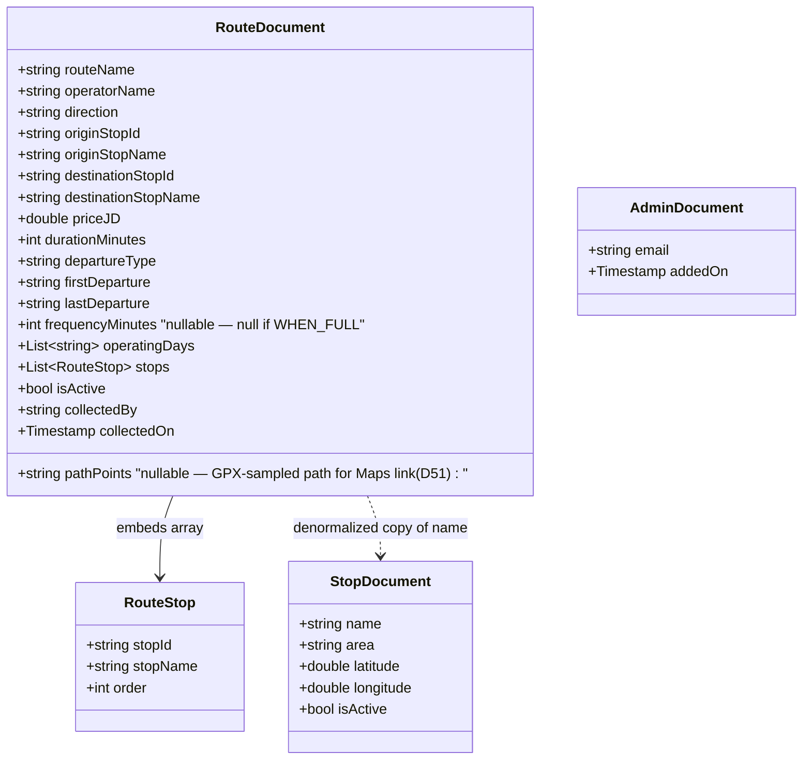

# Coasterna — Firestore Data Model

### Ch.4.2.4 reference — replaces the classic ER Diagram

## Why NoSQL instead of an ER Diagram

This project stores data in Cloud Firestore, a NoSQL document database. There are no foreign keys and no joins. Data is denormalized instead — duplicated in the places it is read, so a search costs exactly one query. This section replaces the classic ER Diagram normally expected in Chapter 4.2.4, and documents the collections, the denormalization decisions behind them, the indexing implications, and the security rules that protect them.

## Collections

### `stops`

| Field | Type | Notes |
|---|---|---|
| name | string | |
| area | string | |
| latitude | number | |
| longitude | number | |
| isActive | boolean | false = excluded from search (e.g. Salt Bus Garages) |

### `routes`

| Field | Type | Notes |
|---|---|---|
| routeName | string | |
| operatorName | string | metadata only — NOT part of uniqueness |
| direction | string enum | OUTBOUND / RETURN |
| originStopId | string | reference to stops.id |
| originStopName | string | denormalized copy |
| destinationStopId | string | reference to stops.id |
| destinationStopName | string | denormalized copy |
| priceJD | number | |
| durationMinutes | number | |
| departureType | string enum | SCHEDULED / WHEN_FULL |
| firstDeparture / lastDeparture | string | |
| frequencyMinutes | number, nullable | null when departureType is WHEN_FULL |
| operatingDays | array\<string\> | |
| stops | array\<map\> | embedded waypoints: stopId (synthetic slug) + stopName + order — NOT searchable |
| isActive | boolean | |
| collectedBy / collectedOn | string / timestamp | field-data provenance |
| pathPoints | string, nullable | `"lat,lng;lat,lng;…"` — points sampled from the route's recorded GPX track, used to steer the "Open in Google Maps" directions link onto the bus's real road instead of a stop-to-stop straight line (decision D51); null when no track has been recorded yet — the maps button then falls back to the single-pin origin link |

### `admins`

| Field | Type | Notes |
|---|---|---|
| Document ID | — | equals the Firebase Auth UID exactly (confirmed Task #4) |
| email | string | |
| addedOn | timestamp | |

### `reports`

A student-submitted data-error report against a route — decision D52, a deliberate and documented deviation from the otherwise-locked three-collection rule (`routes`, `stops`, `admins`).

| Field | Type | Notes |
|---|---|---|
| routeId | string | reference to routes.id — the route this report is about |
| routeName | string | denormalized snapshot of the route's display name at report time — same pattern as originStopName/destinationStopName, so the admin table needs no lookup even if the route is later renamed or deleted |
| reason | string enum | PRICE_INCORRECT / SCHEDULE_INCORRECT / ROUTE_NOT_OPERATING / STOP_INFO_INCORRECT / OTHER |
| otherText | string, nullable | only meaningful when reason is OTHER; null otherwise |
| reportedByUid | string | Firebase Auth uid of the reporting student; Security Rule requires this to equal the caller's own uid on create |
| reportedByName | string, nullable | snapshot of the reporting student's Firebase Auth `displayName` at submit time (decision D53) — same denormalized-snapshot pattern as routeName; null for reports that predate D53 and for accounts that never set a name |
| status | string enum | OPEN / RESOLVED; Security Rule requires every newly created report to be written as OPEN |
| createdAt | timestamp | when the report was submitted |

## Visual Overview



## Denormalization Rationale

Firestore has no joins, so the data model is designed around the app's single dominant read pattern — a student searching by origin (and optionally destination) — rather than around normalized entity relationships. `originStopName` and `destinationStopName` are stored directly inside each route document, in addition to their IDs, so the search results screen can render a complete result including stop names from one query against `routes`, with no second read against `stops` to resolve names. The waypoints inside the `stops` array are embedded as maps rather than kept as their own collection because they have no independent meaning outside the route they belong to and are never queried on their own — they are only ever read together with their parent route, so embedding avoids extra round trips for data that is always consumed as a unit. `operatorName` is stored as descriptive metadata only, and deliberately excluded from the uniqueness key: a route's identity is defined by `originStopId` + `destinationStopId` + `direction`, since that combination is what makes it a distinct physical trip a student can search for — which company happens to run it does not change that identity.

## Indexes

The current queries in `RouteRepository` use only `==` equality filters on a single collection, with no `orderBy`. `getAllStops()` filters `stops` on `isActive` alone. `searchRoutesByOrigin()` filters `routes` on `originStopId` and `isActive`, plus an optional third equality filter on `destinationStopId` when the student picks a "To" stop. Firestore automatically maintains single-field indexes for every field, and merges them to serve equality-only queries like these — so no composite index is required for the MVP search flow. A composite index would only become necessary if a future query added a range filter (for example, filtering by `priceJD`) or an `orderBy` on a field different from the equality filters — tracked as a Future Work item, not a current requirement.

## Security Rules

Public read access is open on `stops` and `routes` so the student search flow works without authentication. All writes on `stops` and `routes` require `isAdmin()`, checked via an `exists()` lookup against the caller's own document in `admins` — the caller is never trusted by a custom claim, only by document presence. The `admins` collection allows a signed-in user to read only their own document (used by the app to decide whether to show the Admin Dashboard) — reading anyone else's admin doc, or listing the collection, is still denied; writes remain fully blocked in both directions, since admin accounts are added manually through the Firebase Console, never through the app. The `reports` collection (decision D52) allows a signed-in student to create a report only under their own uid and only with `status == 'OPEN'` — a student cannot submit a report that's already resolved; reading the collection and resolving a report are both admin-only via `isAdmin()`; deletion is denied entirely, since reports are an audit trail, not queue items that get removed. A default-deny catch-all closes every collection added later until rules are explicitly written for it.

```
rules_version = '2';
service cloud.firestore {
  match /databases/{database}/documents {

    // Returns true only if the currently signed-in user's uid exists
    // as a document ID inside the admins collection. This does NOT
    // require a separate read permission on /admins — exists() checks
    // are evaluated by the rules engine itself, not by the client.
    function isAdmin() {
      return request.auth != null &&
        exists(/databases/$(database)/documents/admins/$(request.auth.uid));
    }

    // stops: every student (signed in or not) can read stop data to
    // search and browse. Only a signed-in admin can add, edit, or
    // delete a stop.
    match /stops/{stopId} {
      allow read: if true;
      allow write: if isAdmin();
    }

    // routes: every student (signed in or not) can read route data to
    // search and browse. Only a signed-in admin can add, edit, or
    // delete a route.
    match /routes/{routeId} {
      allow read: if true;
      allow write: if isAdmin();
    }

    // admins: a signed-in user may read ONLY their own admin document
    // (used by the app to decide whether to show the Admin Dashboard).
    // Reading anyone else's admin doc, or listing the whole collection,
    // is still denied. Writes remain fully blocked in both directions —
    // admin accounts are added manually through the Firebase Console by
    // Tariq or Abdallah, never through the app.
    match /admins/{adminId} {
      allow read: if request.auth != null && request.auth.uid == adminId;
      allow write: if false;
    }

    // reports: decision D52, a deliberate deviation from the
    // otherwise-locked three-collection rule (routes, stops, admins).
    // A signed-in student may submit a report about a route, but only
    // under their own uid (never on someone else's behalf) and only
    // as an OPEN report — a student cannot submit a report that is
    // already resolved. Reading the collection and resolving a report
    // are both admin-only, via the same isAdmin() helper used for
    // routes/stops writes. Deleting a report is denied entirely:
    // reports are an audit trail, not a queue items get removed from.
    match /reports/{reportId} {
      allow create: if request.auth != null &&
        request.resource.data.reportedByUid == request.auth.uid &&
        request.resource.data.status == 'OPEN';
      allow read, update: if isAdmin();
      allow delete: if false;
    }

    // Any other collection not explicitly listed above is fully
    // locked by default. This protects any collection added later
    // (accidentally or intentionally) until rules for it are written
    // deliberately.
    match /{document=**} {
      allow read, write: if false;
    }
  }
}
```